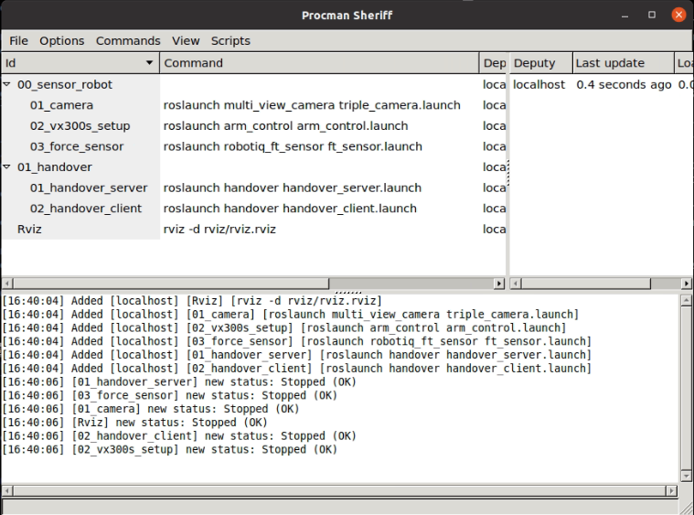

# Handover

## Setup
### Clone repo
```
$ git clone --recursive git@github.com:ARG-NCTU/Handover.git
$ cd Handover
```
### Download HANet pretrianed-weight
```
$ source model_download.sh
```
### Docker
On GPU workstation, run HANet prediction
```
$ source Docker/gpu/docker_run.sh gpu
```
On NUC
```
$ source Docker/nuc/docker_run.sh
```

## How to Start

### Start Procman
```
$ source start_project.sh
```

### Camera and ViperX300s
Restart 00_sensor_robot on NUC

### Handover server and client
Restart 01_handover on workstation
