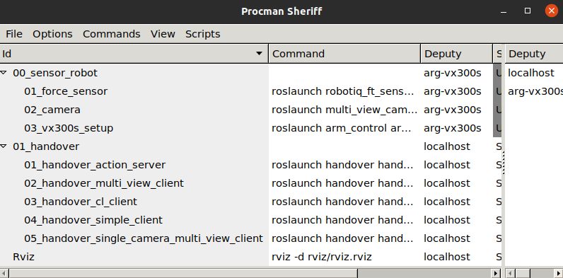
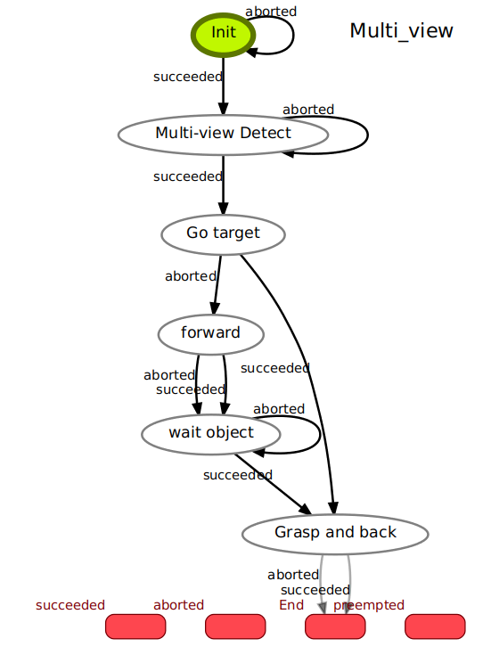
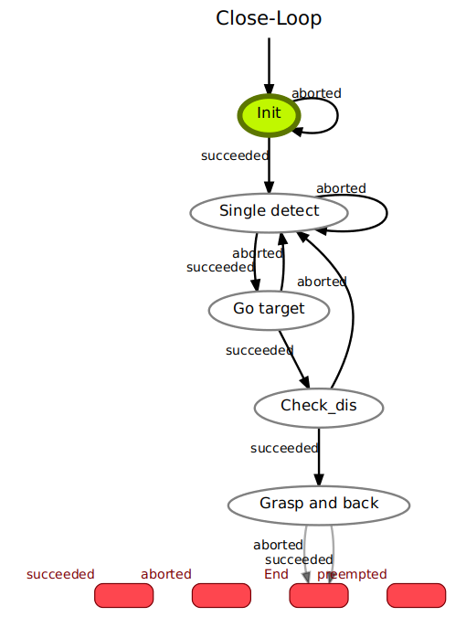
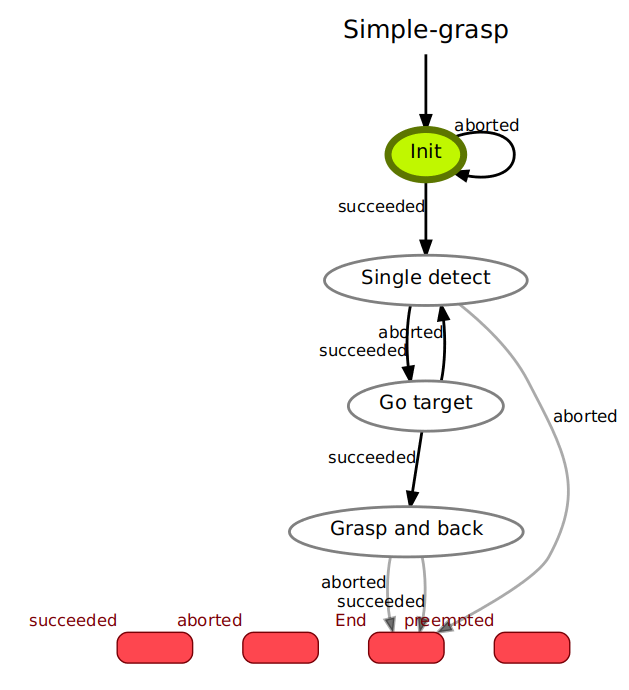

# Handover system

## Setup
### Hardware setup
This system include two computing units, "nuc" for robot arm controlling and sensors, "WS" for HANet inference and handover server and client which has gpu device. 
|Device   | Usage  | GPU  | IP                                                                                                         |
|:---------:|:------------------:|:---------------:|:--------------------------------------------------------------------------------------------------------------------:|
|NUC  | Robot and sensor contorl              | No           | 192.168.0.185  |
|WS  | HANet Inference and Handover state machine              | Yes           | 192.168.0.161  |


### Clone repo
```
$ git clone --recursive git@github.com:ARG-NCTU/handover-system.git
$ cd handover-system
```

### Docker
On GPU workstation
```
$ source gpu_run.sh
```
On NUC
```
$ source nuc_run.sh
```

## How to Start
### Make workspace
```
docker $ source catkin_make.sh
```

### Start Procman
On nuc, set procman deputy
```
docker $ source environment.sh nuc
docker $ source set_remote_procman.sh eno1
docker $ bot-procman-deputy
```
On WS
```
docker $ source environment.sh
docker $ source set_remote_procman.sh eno1
docker $ source start_project.sh
```

### Camera and ViperX300s
Restart 00_sensor_robot on NUC

### Handover server and client
Restart 01_handover on workstation
<p float="left">
  
   
  
</p>
