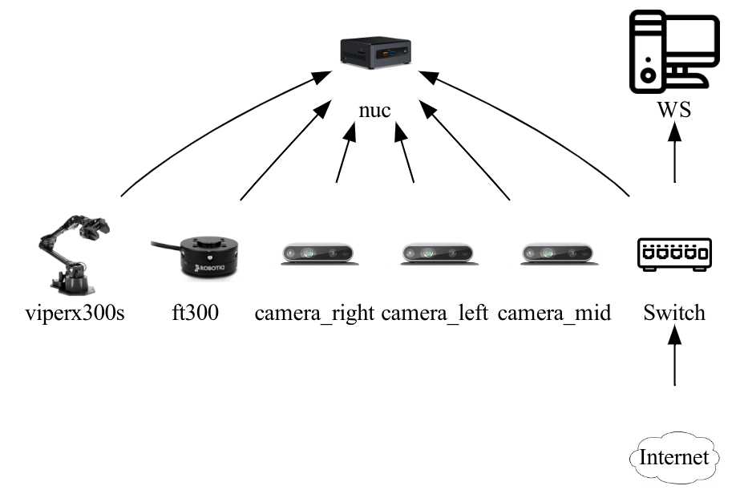

# Handover system

## Setup
### Hardware setup
This system include two computing units, "nuc" for robot arm controlling and sensors, "WS" for HANet inference and handover server and client which has gpu device. 
|Device   | Usage  | GPU  | IP                                                                                                         |
|:---------:|:------------------:|:---------------:|:--------------------------------------------------------------------------------------------------------------------:|
|NUC  | Robot and sensor contorl              | No           | 192.168.50.185  |
|WS  | HANet Inference and Handover state machine              | Yes           | 192.168.50.161  |



### Clone repo
```
$ git clone --recursive git@github.com:ARG-NCTU/handover_affordance.git
$ cd handover-system
```

### Docker
On GPU workstation, run HANet prediction
```
$ source Docker/gpu/docker_run.sh gpu
```
On NUC
```
$ source Docker/nuc/docker_run.sh
```

## How to Start

### Download HANet pretrianed-weight
```
docker $ source model_download.sh
```
### Make workspace
```
docker $ source environment.sh nuc_IP WS_IP
```
```
docker $ source catkin_make.sh
```

### Start Procman
```
docker $ source start_project.sh
```

### Camera and ViperX300s
Restart 00_sensor_robot on NUC

### Handover server and client
Restart 01_handover on workstation